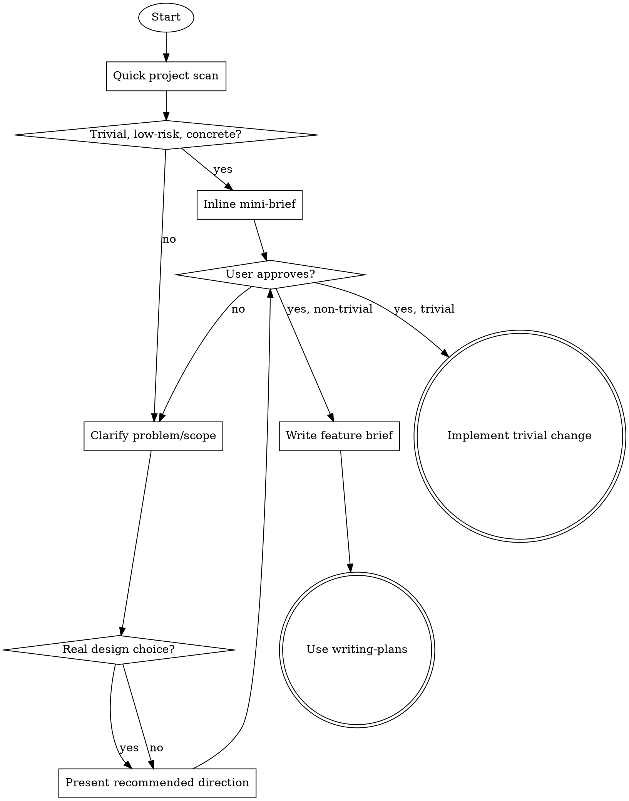

# Brainstorming

Turn an idea into an approved, scoped direction before planning or implementation.

This skill stays at the `what`, `why`, and MVP scope level. It does **not** do implementation planning. Do not design APIs, schemas, file layouts, or task breakdowns here unless the user explicitly asks for that depth.

**Announce at start:** "I'm using the brainstorming skill to clarify scope and recommend a direction."

<HARD-GATE>
Do not write code, scaffold, invoke implementation skills, or start planning until you have presented a direction and the user has approved it.

For trivial requests where the user already stated a concrete direction, a terse inline confirmation counts as approval. Do not force an extra round trip when the safest path is obvious.

For trivial, localized, low-risk changes, a 1-3 sentence inline mini-brief is enough. Do not force a design file or a separate planning step for those cases.
</HARD-GATE>

## When to Use

- when the request is still fuzzy, open-ended, or has meaningful product or scope choices
- when a feature, behavior change, or workflow needs an agreed direction before planning
- when the safest implementation path depends on clarifying the problem, constraints, or MVP
- do not use for trivial, localized changes where the direction is already obvious and low-risk

## Core Rules

- Ground the conversation in reality. If there is an existing project, do a quick scan first.
- Ask the highest-value question first. Prefer one question at a time.
- Include your recommendation whenever you ask a question or present options.
- Call out assumptions explicitly. Mark unresolved items as `TBD`.
- Default to the smallest useful version. Cut scope aggressively.
- Stay conversational. Do not turn this into a form or a ritual.
- Do not invent multiple approaches when one option is obviously right.

## Workflow



### 1) Ground

If a codebase exists, do a quick scan to understand what exists today and what would change.

### 2) Clarify

Get clear on:

- **Problem** - what is missing or wrong, and why it matters now
- **Who benefits** - user, operator, teammate, or just the human partner
- **Done when** - concrete success conditions
- **Constraints** - stack, compatibility, time, risk, or non-negotiables
- **Scope** - what belongs in MVP and what does not

Do not over-interview. If the user already gave enough detail, summarize it and move on.

For large or fuzzy requests, summarize knowns, assumptions, unknowns, and the few decisions that materially affect scope. Ask only the highest-leverage question needed to move forward.

### 3) Explore

If there is a real decision to make, propose 1-3 viable directions.

For each direction, cover:

- core idea
- key tradeoffs
- biggest risk

Lead with your recommendation and explain why.

### 4) Capture

Once the user confirms the direction, capture it in one of two forms:

- **Mini-brief** - for trivial, localized, low-risk work; keep it inline in the conversation
- **Feature brief** - for non-trivial or multi-step work; save it to `docs/plans/YYYY-MM-DD-<feature-name>-brief.md`

Use only the sections that matter. Skip empty sections instead of filling them with noise.

## Exit Criteria

Brainstorming is complete when all of these are true:

- the problem is clear
- `done when` is concrete
- MVP scope is agreed
- the recommended direction is accepted

At that point, stop asking discovery questions. Either hand off to `writing-plans` or proceed with trivial implementation work.

## Feature Brief Template

```markdown
# <Feature Name>

## Problem
<What is missing or broken, who it affects, and why it matters now.>

## Done When
- <concrete condition>
- <concrete condition>

## Constraints
- <non-negotiable limitation>

## Recommended Direction
<What we are building at a high level and why this direction wins.>

## Alternatives Considered
- <option> - <why not chosen>

## Scope
- **In:** <MVP>
- **Out:** <explicit non-goals>

## Risks
- <risk> - <mitigation or TBD>

## Open Questions
- <only unresolved items that planning must handle>
```

## Handoff

If the work is multi-step, has meaningful uncertainty, or needs technical design, the next skill is `writing-plans`.

If the work is trivial and the user approved the mini-brief, planning can be skipped and implementation may begin.

If the next step is implementation rather than planning, start with `test-driven-development` for behavior changes or bug fixes when tests are practical. For pure configuration or low-risk documentation-style changes, implement directly and use `verification-before-completion` before claiming success.

If the user only wanted help scoping the work, stop after the mini-brief or feature brief instead of forcing a handoff.

## Anti-Patterns

- Treating every tiny config tweak like a full design review
- Asking low-value questions when the safest default is obvious
- Mistaking brainstorming for planning
- Presenting fake alternatives just to satisfy a template
- Continuing to interview after the MVP is already clear
- Starting implementation in the same step as unapproved brainstorming
