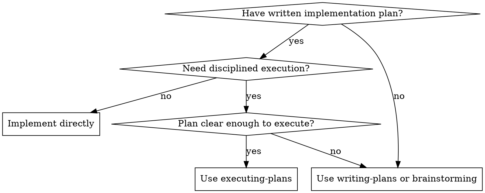

# Executing Plans

Execute an implementation plan one task at a time.

This skill is for implementation, not planning. The plan should already contain the technical decisions. If it does not, stop and send the work back to `writing-plans` instead of guessing.

**Core principle:** Review the plan critically, execute one task at a time, verify before marking complete, and stop when plan reality diverges.

**Announce at start:** "I'm using the executing-plans skill to implement this plan."

## When to Use

- Use when you already have a written plan, usually from `writing-plans`.
- Use when you want disciplined execution with checkpoints instead of improvising from memory.
- Do not use when the input is still a vague idea or missing key technical decisions.
- Do not use when the plan is so small and obvious that a dedicated execution workflow adds no value.

## Core Rules

- Read the full plan before editing anything.
- Treat the plan as executable guidance, not unquestionable authority.
- Execute one plan task at a time unless the current task explicitly contains tiny, tightly related subtasks.
- Verify each task before marking it complete.
- Match the codebase's existing patterns and conventions.
- Do not silently fix, redesign, or expand the plan.
- If the codebase, tests, or external docs contradict the plan, stop at that task boundary and surface the mismatch.
- Do not claim completion for unverified work.

## Workflow

### 1) Load and Review the Plan

Before writing code:

1. Read the full plan.
2. Create a todo list from its tasks.
3. Review critically for gaps, stale assumptions, missing files, risky sequencing, or unclear verification.
4. If the plan is not executable as written, stop and report the issue before starting.

Check especially for:

- tasks that depend on earlier tasks actually landing in a working state
- file paths or modules that may have moved
- verification steps that no longer match the repo
- external library or API steps that may need fresh docs

### 2) Execute One Task

For the current task:

1. Mark it `in_progress`.
2. Read the referenced files and surrounding code before editing.
3. Make the minimum change needed to satisfy the task.
4. Follow the plan's verification steps for that task.
5. If verification passes, mark the task complete.
6. Report progress at the appropriate checkpoint before continuing.

If a task is larger than expected, you may break it into working sub-steps for yourself, but do not silently merge, reorder, or redefine plan tasks.

### 3) Revalidate When Reality Changes

Stop immediately at the current task boundary when:

- a referenced file, function, or interface no longer exists
- the plan assumes behavior that the current codebase contradicts
- an external dependency, API, CLI, or hosted service may have changed
- verification fails in a way the plan did not anticipate
- completing the next task would require a design decision not already made

When that happens:

1. Preserve already completed valid work.
2. State the exact mismatch.
3. Propose the smallest plan correction.
4. Do not skip ahead or reorder remaining tasks unless the revised plan explicitly approves it.
5. Wait for confirmation or a revised plan before continuing dependent tasks.

### 4) Report Checkpoints

After each meaningful task boundary, report:

- what changed
- what verification ran
- what passed or remains unresolved

Do not say work is done just because code was written. Completion means the task's verification passed, or you clearly state what could not be verified.

### 5) Final Verification

After all tasks are complete:

- run the plan's final verification steps
- if the project has tests, run the relevant suite and the full suite when the plan or repo conventions call for it
- if the project has a build step, run it when relevant
- report implemented work, verification results, and any remaining manual checks

### 6) Finish the Branch

After implementation and verification are complete:

- Announce: "I'm using the finishing-a-development-branch skill to complete this work."
- **REQUIRED SUB-SKILL:** Use finishing-a-development-branch

## External Dependencies

For any task that depends on a third-party library, API, CLI, or hosted service:

- verify the current contract before implementing that task
- use Context7 or WebFetch as needed
- if current docs conflict with the plan, stop and surface the delta before proceeding

Do not implement against memory when the contract may have drifted.

## Common Mistakes

- Treating the plan like a script to obey blindly even when reality changed
- Marking tasks complete after code changes without running verification
- Continuing past a stale or broken task instead of pausing for a minimal plan update
- Guessing at external APIs instead of rechecking current docs
- Quietly expanding scope with opportunistic refactors or improvements
- Reporting completion before integrated verification is done

## Exit Criteria

Execution is complete when:

- every plan task is either completed and verified or explicitly paused with a surfaced issue
- plan deviations were approved instead of implied
- final verification ran and results were reported
- branch completion is handed off to `finishing-a-development-branch`
