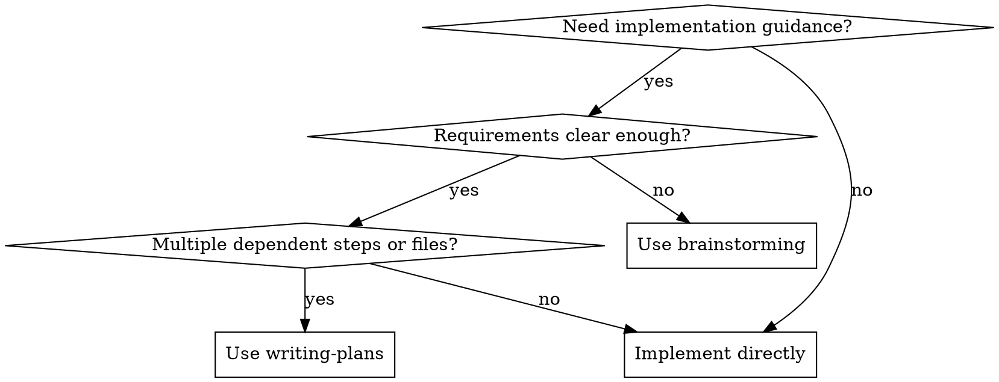

# Writing Plans

Turn an approved feature brief or clear requirements into an implementation plan grounded in the real codebase.

This skill is for technical decision-making and sequencing. It is **not** brainstorming, and it is **not** implementation. Do not write production code here.

**Announce at start:** "I'm using the writing-plans skill to create the implementation plan."

## When to Use



- Use after `brainstorming`, or when the user already gave clear scope, constraints, and success criteria.
- Use when work spans multiple files, layers, decisions, or verification steps.
- Use even for small work if it has 3+ dependent steps or coordination across components. Treat this as a heuristic, not an automatic requirement, when the change is still trivial and low-risk.
- Do not use when the request is still vague enough that major solution branches are unresolved; go back to `brainstorming` first.
- Do not use for trivial, localized, low-risk edits that can be executed safely without a separate plan.

## Core Rules

- Research the codebase before making technical decisions. Do not plan against assumptions.
- Ask questions only when the codebase and relevant docs cannot answer them.
- Include your recommendation whenever you ask a question or present options.
- Keep the plan specific enough to execute, but do not write production code.
- Right-size the plan to the task. Do not explode simple work into ceremony.
- Identify the smallest set of changes that delivers the requirement. Resist unrelated refactors.
- Never invent file paths, line numbers, commands, outputs, APIs, or library behavior.
- Separate confirmed facts from assumptions and open questions.

## Inputs

Best input:

- a feature brief from `brainstorming`, typically `docs/plans/YYYY-MM-DD-<feature-name>-brief.md`
- or a user request that already defines what to build, why it matters, and what is in or out of scope

If the input is still materially fuzzy, stop and recommend `brainstorming` instead of guessing.

## Workflow

### 1) Validate Readiness

Confirm that all of these are clear enough to plan against:

- problem or goal
- success criteria
- scope boundaries
- major constraints

If any of those are missing in a way that would change the implementation approach, do not plan yet.

### 2) Research

Read the brief or request, then inspect the codebase areas that the work touches.

Always do codebase research:

- identify the modules, files, and boundaries involved
- inspect existing patterns and conventions to follow
- find the relevant tests, scripts, and verification paths if they exist
- resolve open questions through investigation where possible

Do external research only when needed:

- use Context7 for current library or framework docs
- use WebFetch for specific documentation pages, changelogs, or migration guides
- verify the project's current dependency version or installed tool before planning around it
- verify version-sensitive APIs before putting them in the plan

If a new dependency or upgrade may be needed, record that as a technical decision or open question instead of assuming it is already approved.

If something is still unknown after research, capture it explicitly as an assumption, risk, or open question.

### 3) Decide

Make the technical decisions the implementer should not have to rediscover.

Examples:

- where new code should live
- whether to extend existing files or create new ones
- how data or control flows through the affected system
- what needs test coverage and how it should be verified using existing project patterns
- what order the changes should happen in

If there are meaningful design options, present 1-3 viable directions with tradeoffs and your recommendation. If one path is clearly right, say so and move on.

### 4) Plan

Write the implementation plan to `docs/plans/YYYY-MM-DD-<feature-name>.md`.

The plan should be:

- ordered so each task builds on prior work
- specific about areas and files to touch when known from research
- explicit about verification
- free of production code snippets and fabricated details

Use exact file paths when you verified them from the repo. If you have not verified the exact file yet, name the area or pattern to inspect instead of guessing.

## Output Template

```markdown
# <Feature Name> Implementation Plan

> **For Claude:** REQUIRED SUB-SKILL: Use superpowers:executing-plans to implement this plan task-by-task.

**Goal:** <one sentence>

**Context:** <2-4 sentences summarizing the feature, the chosen approach, and any important constraints>

## Research Notes
- <existing pattern or file area to follow>
- <relevant dependency or API fact, if verified>
- <known constraint, gotcha, or assumption>

## Technical Decisions
- <decision> - <why>
- <decision> - <why>

## Tasks

### 1. <Short task name>
- **Files:** `<verified/path>`; `<another/path>`
- **Changes:** <what to add, modify, or remove>
- **Why:** <brief rationale if not obvious>
- **Verify:** <test file, script, manual check, or behavior to confirm>
- **Watch out:** <optional risk or edge case>

### 2. <Short task name>
- **Files:** ...
- **Changes:** ...
- **Verify:** ...

## Open Questions
- <only unresolved items that execution may need to answer>

## Verification
- <commands verified from the repo, if known>
- <manual behaviors to confirm>
- <note if no automated tests exist>
```

## Common Mistakes

- Writing the plan from memory instead of inspecting the repo
- Planning against vague requirements that should go back to `brainstorming`
- Smuggling implementation into the plan with code blocks or guessed APIs
- Inventing line numbers, test commands, or outputs that were never verified
- Planning unrelated refactors because they look nice
- Omitting verification or test updates when the repo already has testing patterns

## Handoff

After saving the plan, recommend the next step directly:

**"Plan complete and saved to `docs/plans/<filename>.md`. Next step: use `executing-plans` to implement it with review checkpoints."**

## Exit Criteria

Planning is complete when:

- the implementation approach is grounded in the codebase
- tasks are ordered and actionable
- verification is defined
- risks and unknowns are explicit
- no production code is doing hidden implementation work inside the plan
